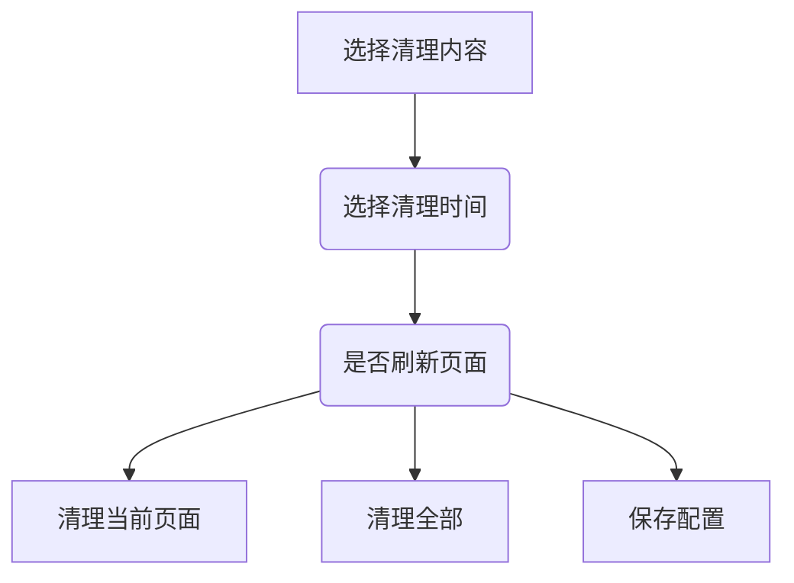

### 缓存清理插件

#### 功能介绍

- 清理当前页面的缓存
- 清理所有缓存
- 根据时间清理缓存
- 保存配置

#### 配置文件介绍

```json
{
  "manifest_version": 2,
  "name": "Clear Cache",
  "version": "1.0.0",
  "description": "Clears your cache and browsing data with a click of a button",
  "icons": {
    "16": "img/icon_16.png",
    "48": "img/icon_48.png",
    "128": "img/icon_128.png"
  },
    //点击图标的时候触发
  "browser_action": {
    "default_icon": "img/icon_19.png",
    "default_title": "Clear Cache",
    "default_popup": "options.html"
  },
    //权限设置 
  "permissions": ["browsingData", "cookies", "<all_urls>", "notifications", "activeTab", "tabs","storage"]
}
```

**权限设置**

- browsingData 浏览器缓存
- cookies cookies
- <all_urls>  匹配所有的url
- notifications 通知权限
- activeTab   当前tab页
- tabs 所有tab页
- storage  存储

#### 流程介绍


##### **插件图案**


##### 具体流程




#### 代码解释

该插件主要涉及到的知识点有browser_action、browsingData、notifications、storage

1. browser_action

   

   > 官网描述
   >
   > Use browser actions to put icons in the main Google Chrome toolbar, to the right of the address bar. In addition to its [icon](https://developer.chrome.com/docs/extensions/reference/browserAction/#icon), a browser action can have a [tooltip](https://developer.chrome.com/docs/extensions/reference/browserAction/#tooltip), a [badge](https://developer.chrome.com/docs/extensions/reference/browserAction/#badge), and a [popup](https://developer.chrome.com/docs/extensions/reference/browserAction/#popups).

   从官网的描述来看，就是在浏览器的左上角添加一个图标，然后点击图片弹出指定的页面

   经过实践，最终出来的效果就是上面的插件图案

   当然我们也可以对该事件经行监听，监听方法如下

   ```
   chrome.browserAction.onClicked.addListener(function(tab) {
     
   });
   ```

2. browsingData

   > 官网描述
   >
   > Use the `chrome.browsingData` API to remove browsing data from a user's local profile

   该描述简单来说就是chrome自带的清理缓存功能

   当然我们可以指定清理目标，如网站缓存，cookies，历史记录等等，根据时间去清理数据

 **清理指定目标的数据**

该方法有局限性，根据官网的解释，清理指定目标的时候只支持清除cookies，storage和cache

```
    chrome.browsingData.remove({
        "origins": ["url"],
        "since": time
    },  {
        "cookies": true,
        "appcache": true, //网站的缓存数据
        "cache": true
    }, clearSuccess(tabId, params.reloadHtml));
```

**清除所有数据**

```
   chrome.browsingData.remove({
        "since": params.time
    }, {
        "cookies": true,
        "appcache": true, //网站的缓存数据
        "cache": true,
        "history": true,
        "downloads": true,
        "fileSystems": true,
        "indexedDB": true,
        "localStorage": true
    }, clearSuccess(null, null));
```

上面两种方法中都包含了一个变量**since**,该变量的意思是删除指定时间以内的内容

比如1小时以内，30分钟。。。。

如果没有指定，那么默认是0，删除所有数据

3. notifications

   > 官网描述
   >
   > Use rich desktop notifications to notify users that something important has happened. Notifications appear outside the browser window

顾名思义，将指定的内容以弹框的形式通知给用户，有点类似有**alert**，但是不同的地方是该方法不会影响用户的操作，只是简单的在浏览器的下面添加一个通知弹框。如下图所示


**具体方法**

```
chrome.notifications.create(null, {
        type: 'basic',
        iconUrl: 'img/icon_128.png',
        title: '清除缓存',
        message: '清除缓存成功,刷新页面'
    }, callback);
```


4. storage

   > 官网描述
   >
   > Use the `chrome.storage` API to store, retrieve, and track changes to user data.

简单来说就是将数据存储在本地，类似于nosql。

注意一下方法都是异步的。

```
chrome.storage.local.set({key: value}, function() {
  console.log('Value is set to ' + value);
});

chrome.storage.local.get(['key'], function(result) {
  console.log('Value currently is ' + result.key);
});
```


#### [具体源码]()